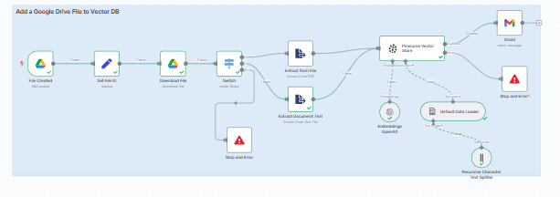

# Workflow Explanation

This workflow automates the process of monitoring a Google Drive folder for new file uploads, processing the files based on their format, and storing their embeddings in a Pinecone vector database. Below is a breakdown of each node's functionality, configuration, and the strategy for handling different document formats.

---

## **1. Google Drive Trigger**
- **Function**: Monitors a specified Google Drive folder for new file uploads. The workflow is triggered automatically when a new file is detected in the folder.
- **Configuration**:
  - **Folder ID**: `1d0kVGjifWGJ_F3ROp5slazNtmoFEDCzP` (Project Polaris)
  - **Trigger Event**: `fileCreated` (activates when a new file is uploaded)
  - **Polling Interval**: `everyMinute` (checks for new files every minute)
- **Output**: File metadata including:
  - `id`: Google Drive file ID
  - `mimeType`: File type (e.g., `application/pdf`, `application/vnd.google-apps.document`)
  - `name`: File name

---

## **2. Set File ID**
- **Function**: Standardizes and enhances the file metadata for downstream processing.
- **Configuration**:
  - **Fields**:
    - `file_id`: Extracts the Google Drive file ID (`$json.id`).
    - `file_type`: Extracts the MIME type (`$json.mimeType`).
    - `file_name`: Extracts the file name (`$json.name`).
- **Output**: A structured object with the file metadata, passed to the next node.

---

## **3. Download File**
- **Function**: Downloads the file from Google Drive and converts Google Docs files to plain text for easier processing.
- **Configuration**:
  - **Operation**: `download`
  - **File ID**: Dynamically references `$json.file_id` from the previous node.
  - **Google Docs Conversion**: Converts Google Docs to `text/plain` format.
- **Output**: Binary file data (for PDFs) or plain text (for DOCXS,TXT).

---

## **4. Switch (Conditional Routing)**
- **Function**: Routes files to the appropriate text extraction node based on their MIME type.
- **Configuration**:
  - **Rules**:
    1. **PDF Files (PDF)** (`application/pdf`):
       - Routes to the **Extract from File (PDF)** node.
    2. **Google Docs (DOCX, TXT)** (`application/vnd.google-apps.document`):
       - Routes to the **Extract Document Text** node.
- **Output**: Files are directed to the correct processing path.

---

## **5. Extract from File (PDF)**
- **Function**: Extracts text content from PDF files.
- **Configuration**:
  - **Operation**: `pdf`
- **Output**: Extracted text from the PDF.

---

## **6. Extract Document Text (DOCX, TXT)**
- **Function**: Extracts text from Google Docs (already converted to plain text in the Download File node).
- **Configuration**:
  - **Operation**: `text`
- **Output**: Extracted text from the document.

---

## **7. Recursive Character Text Splitter**
- **Function**: Splits extracted text into smaller chunks for embedding generation, ensuring optimal processing.
- **Reason for Use**: Chosen for its intelligent capability to recursively split text while preserving semantic meaning.
- **Configuration**:
  - **Chunk Size**: `200` characters
  - **Chunk Overlap**: `10` characters
  - **Split Code**: `markdown` (handles markdown formatting if present)
- **Output**: Text chunks ready for embedding.

---

## **8. Default Data Loader**
- **Function**: Prepares the text chunks for embedding by attaching metadata.
- **Configuration**:
  - **Metadata**:
    - `file_id`: References `$('Set File ID').item.json.file_id`
    - `file_name`: References `$('Set File ID').item.json.file_name`
- **Output**: Text chunks with associated metadata.

---

## **9. Embeddings OpenAI**
- **Function**: Generates embeddings (vector representations) of the text chunks using OpenAI's `text-embedding-3-small` model.
- **Configuration**:
  - **Model**: `text-embedding-3-small`
- **Credentials**: Uses `OpenAI API credits`.
- **Output**: Embeddings for each text chunk.

---

## **10. Pinecone Vector Store**
- **Function**: Stores the generated embeddings in a Pinecone vector database for retrieval and search.
- **Configuration**:
  - **Operation**: `insert`
  - **Pinecone Index**: `n8n-rag`
- **Credentials**: Uses `PineconeApi account`.
- **Output**: Embeddings are indexed and stored in Pinecone.

## 11. Stop and Error Nodes

**Function:**  
Halts the workflow execution and raises an error if an unsupported file type is encountered or if the vector store operation fails.

**Configuration:**

- **Error Message:** Custom message (e.g., `Invalid data object`) to indicate the reason for stopping.

**Trigger Conditions:**

- **Stop and Error:** Triggered when the Switch node encounters an unsupported file type.
- **Stop and Error1:** Triggered if the Pinecone Vector Store node fails to insert embeddings.

**Output:**  
Stops the workflow and logs the error.

---

## 12. Gmail Node

**Function:**  
Sends an email notification to confirm the successful addition of a document to the vector database.

**Configuration:**

- **Recipient:** `test@gmail.com`
- **Subject:** `Document Added`
- **Message:** Includes dynamic content (e.g., `The document added to the vector db. {{ $json.metadata.file_name }}`) to display the filename.
- **Trigger Condition:** Executes after the Pinecone Vector Store node successfully inserts embeddings.
- **Credentials:** Uses Gmail OAuth2 for authentication.

- **Output:**  
Sends an email with details of the processed document.
---

## **Strategy for Handling Different Document Formats**
1. **Conditional Routing**
   - The **Switch** node checks the `file_type` and routes files to the appropriate extraction node
     - **PDFs**: Processed by the **Extract from File (PDF)** node.
     - **DOCX, TXT**: Converted to plain text during download and processed by the **Extract Document Text** node. 
     
     Like wise other document formats (CSV,XLXS,HTML.. etc) can be treated as accordingly based on the requirement.
     
2. **Text Processing**
   - All extracted text is split into chunks for consistent embedding generation.
3. **Metadata Preservation**
   - File metadata (ID, name) is attached to embeddings for traceability.

---

## **Vector Database Selection**

# Vector Database Selection

## 1. Performance Characteristics

- **Pinecone**: Delivers ultra-low latency (sub-10ms P99) using proprietary ANN indexing techniques. Optimized for real time vector similarity searches even across large scale datasets.
- **Weaviate**: Utilizes HNSW indexing combined with BM25 for hybrid vector + keyword search. Performance is strong, but hybrid search incurs slightly higher overhead compared to pure ANN.
- **Chroma**: Performs well in memory for small datasets, but degrades significantly with scale (typically >100K vectors).
- **PGVector**: Relies on sequential scan or IVF/flat index methods. Tends to exceed 100ms latency as data grows.
- **MongoDB Atlas**: Offers vector search via IVF indexing but lags behind dedicated solutions in latency benchmarks (typically 30ms–100ms).

**Summary**: Pinecone demonstrates the most consistent and low latency performance under high-load scenarios.

---

## 2. Scalability Factors

- **Pinecone**: Fully managed SaaS platform with support for serverless and pod-based scaling models. Handles higer ingestion rates and supports billions of vectors with minimal configuration.
- **Weaviate**: Horizontally scalable via Kubernetes; however, self hosted versions require infrastructure management unless deployed on Weaviate Cloud Services.
- **Chroma**: Primarily designed for local or prototyping purposes. Chroma Cloud is in early stages and does not support robust sharding or distributed scaling.
- **PGVector**: Constrained by PostgreSQL's vertical scaling limitations. Scaling across partitions requires complex schema design.
- **MongoDB Atlas**: Scales well at the database level, but not optimized for high throughput vector operations.

**Summary**: Pinecone offers seamless, automated scaling suitable for production-grade document systems.

---

## 3. Integration Complexity

- **n8n Integration**:
  - **Pinecone**: Offers smooth integration with n8n. This makes it easy to embed within automated workflows for document ingestion, embedding, and retrieval.
  - **Weaviate**: Currently lacks a native n8n plugin. Integration is only possible through manual HTTP requests, requiring configuration of GraphQL queries and authentication headers, which increases complexity and development time.
  - **Chroma** and **MongoDB**: No native support or existing n8n modules. Integration requires custom scripting or bridging components, making them less suited for automated no-code/low-code pipelines.

- **API & SDK Support**
  - **Pinecone**: Offers clean and robust SDKs for Python, Node.js, and Go, along with REST and gRPC APIs. Easily integrates into LLM-driven pipelines such as LangChain and OpenAI.
  - **Weaviate**: Provides REST and GraphQL APIs, and supports multiple client SDKs. However, API usage is slightly more involved due to custom schema and class management.
  - **Chroma**: Primarily built for Python environments, limiting out of the box compatibility with workflow orchestration tools or multi-language stacks.
  - **PGVector**: Requires significant setup effort, including PostgreSQL configuration, extension installation (`pgvector`), and custom schema modeling.
  - **MongoDB Atlas**: Offers good integration within its own Atlas ecosystem and supports some vector search functionality, but it lacks native alignment with modern vector-based LLM pipelines.

**Summary**: Pinecone is best positioned for seamless integration both programmatically and within automated tools like n8n making it the most developer friendly choice among evaluated options.

---

## 4. Use Case Alignment

| Requirement                         | Pinecone | Weaviate | Chroma | PGVector | MongoDB |
|------------------------------------|----------|----------|--------|----------|---------|
| Multi-format document support      | ✗        | ✅        | ✗      | ✗        | ✅       |
| Metadata-based filtering           | ✅        | ✅        | Basic  | Limited  | ✅       |
| Cross-document similarity          | ✅        | ✅        | ✅      | Partial  | ✗       |
| Security & access control          | ✅        | ✅        | ✗      | ✅        | ✅       |
| Compliance (GDPR, HIPAA)           | ✅        | ✅        | ✗      | ✅        | ✅       |
| Real-time ingestion & retrieval    | ✅        | ✅        | ✗      | ✗        | ✗       |
| Native n8n integration             | ✅        | ✗        | ✗      | ✗        | ✗       |

While Weaviate offers advanced features such as hybrid search, auto-classification, and robust support for multi-format document ingestion (including PDF, DOCX, and TXT), the integration overhead due to the absence of a native n8n plugin impacts development velocity. Although integration with Weaviate is still possible through HTTP requests, it requires manual setup of GraphQL endpoints and authentication flows, which complicates what should ideally be a simple workflow. On the other hand, Pinecone provides a production-ready stack that integrates cleanly with modern LLM workflows, embedding pipelines, and external document processors. Given the lack of native plugin support for Weaviate in n8n, I selected Pinecone to streamline integration, reduce complexity, and accelerate deployment.

---

## Final Recommendation

After a thorough evaluation, **Pinecone** is selected as the vector database of choice for the following reasons:

- **Exceptional performance** at scale with ultra-low query latency
- **Effortless scalability** via a fully managed, cloud-native infrastructure
- **Seamless integration** with embedding pipelines and automation tools (including n8n)
- **Reliable support for metadata filtering**, real-time ingestion, and enterprise-grade operations

While Weaviate offers advanced capabilities such as hybrid search (vector + keyword), multi-tenancy, and auto-classification, it also supports ingestion of multi-format documents natively through its built in modules an undeniably strong advantage for enterprise document management use cases. However, despite its feature richness, Weaviate currently lacks a native plugin for n8n. Although integration is technically possible via HTTP requests (e.g., REST or GraphQL), this adds complexity and manual configuration effort to what would ideally be a streamlined automation workflow. Given this integration overhead—and the absence of a ready-to-use connector for low-code environments like n8n—Pinecone was selected instead. Pinecone offers a production-ready stack that integrates cleanly with modern LLM workflows, embedding pipelines, and external document processors, while also allowing seamless automation through n8n with minimal setup.

---
