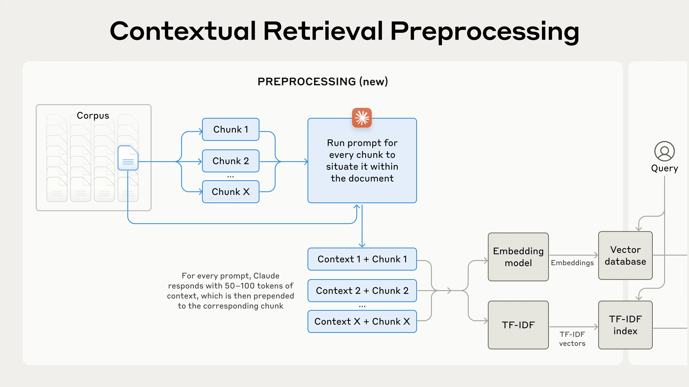

## Data Retrieval Architecture

## Prompt Engineering and Template Design

One of my primary priorities was to ensure that the language model provides factual, grounded responses strictly based on the context retrieved from the database. The prompt was explicitly designed with the following characteristics:

### Strict Instruction Set
The template enforces three key rules
1. **Do not answer without context.**
2. **Do not hallucinate or use external knowledge.**
3. **Keep answers concise and factual.**

These rules help ensure the LLM behaves predictably and reliably in a Retrieval-Augmented Generation (RAG) setting.

### Structured Format
The prompt follows a clear structure with dedicated sections for:
- **Context**: Retrieved content from the vector database.
- **Question**: The user's input.
- **Answer**: The model's output.

This separation reinforces boundaries and prevents the model from relying on prior knowledge or drifting off-topic.

### Minimal Prompt Tokens
The prompt is intentionally concise, avoiding verbose instructions. This keeps the token count low, optimizing for both cost and latency, while still preserving clarity of instruction.

This overall design aligns with best practices for building safe, reliable, and deterministic RAG systems—especially in environments where trust in the generated output is critical.

---

## Retrieval Quality Optimization Strategies

To ensure high quality and relevant document retrieval, I adopted the following strategies

### Vector Indexing with Pinecone
All source documents were embedded using contextual embeddings and stored in Pinecone’s vector database. This allows for fast and scalable similarity search across large datasets.

### Metadata Enrichment
Each document chunk was tagged with metadata such as
- Source file name
- Document Id

This metadata is included in the response to enhance transparency and traceability, allowing users to verify the origin of each answer.

---

## A Note on Further Improving Retrieval

While the current system retrieves relevant chunks effectively, one highly promising optimization is the use of **Contextual Retrieval**, which enhances semantic relevance by injecting additional context into each chunk before vectorization or keyword indexing.

### Contextual Embeddings
Contextual retrieval solves the problem of semantically vague or ambiguous chunks by **prepending chunk-specific metadata or explanatory content** to each chunk before generating embeddings. This process results in what’s called **contextual embeddings**.

source - https://www.anthropic.com/news/contextual-retrieval

#### Example:
Let’s say we have the following raw chunk:

"The company's revenue grew by 3% over the previous quarter."

By applying contextualization, we prepend background information:

"This chunk is from an SEC filing on ACME Corp’s performance in Q2 2023; the previous quarter's revenue was $314 million. The company's revenue grew by 3% over the previous quarter."

The added context helps the embedding model better understand the meaning and intent behind the text, allowing more accurate and relevant retrieval.